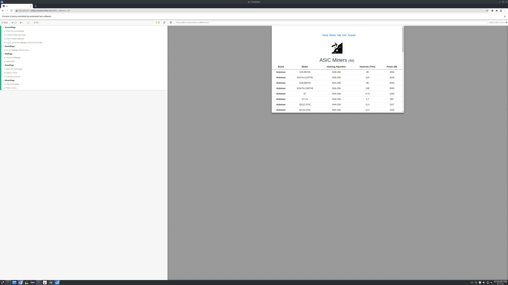

# Project 3
+ By: *Nikolas Millier*
+ Production URL: <http://e28p3.nikolasmillier.com>

## Outside resources
+ Logo Source: http://getdrawings.com/miner-icon#miner-icon-8.png (*By Avocadorable*)

## How is authentication being used in your application?
*Authentication is used to restrain the access to the addPage.  
The addPage is used to add new miners to the database.*

<<<<<<< HEAD
## What data entities of your application are being managed via Vuex?
*The miners count in the minerPage uses Vuex to update the count*

## E2E Testing screenshot

=======
## Outside resources
+ Logo Source: http://getdrawings.com/miner-icon#miner-icon-8.png (*By Avocadorable*)
>>>>>>> c26155d1f88f570f3e478a5c1571d4d9d143d9ca
